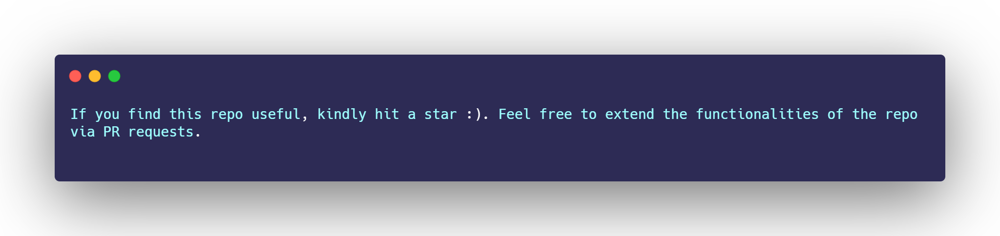
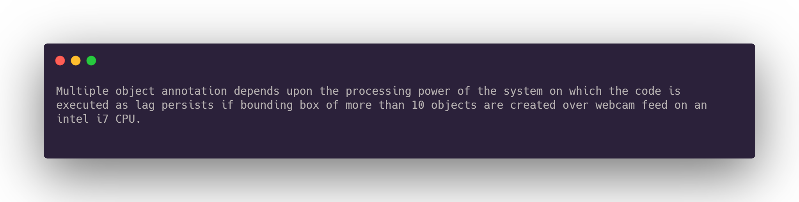
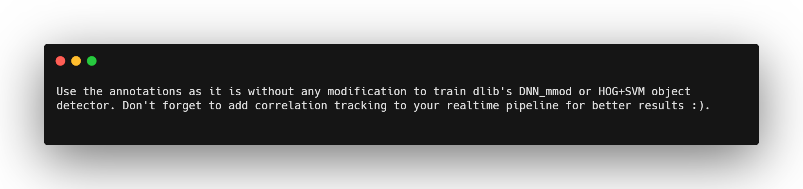

## Demo Video
<a href="https://youtu.be/T67T9KhiwFU"> Link </a>

## Cognitive Annotation Tool
#### About the Software 
* An opensource annotation tool aimed to help researchers get rid of annotating images manually for computer vision tasks like object detection and object localisation using the webcam feed. 
* The Tool creates annotation of images in <a href="http://host.robots.ox.ac.uk/pascal/VOC/"> Pascal VOC </a> format as .xml files corresponding to each image. The tool also generates annotations as csv file.
* The generated annotations are compatible for training machine learning/deep learning models using <a href="https://github.com/davisking/dlib"> Dlib- C++ </a> machine learning library or <a href="https://arxiv.org/abs/1708.02002"> Retinanet </a> based object detection models easily for custom object detection. For training retina-net based model, The user can refer to this <a href="https://github.com/fizyr/keras-retinanet">Github Repo. </a> 
* The Images and its corresponding annotation XML files are saved in the folder named entered by user in the GUI prompt during the initialisation of the software. 
* If the user wants to train a multi-stage object detector like Fast RCNN/Faster RCNN/Retinanet model for custom object detection then this jupyter notebook can be used to convert the Pascal VOC Annotation xml file(s).
* The software is capable of annotating bulk of images needed to create high quality custom machine learning/deep learning based object detectors from scratch or via Transfer learning.
* This tool can act as an automated version of <a href="https://imglab.in/"> ImgLab </a>

## Windows Executable
<a href=""> Download Link </a> :: Coming soon.

## Execute using terminal

### Prerequisite
1. Anaconda/Miniconda installed on Windows/Linux platform (Last checked to work on Windows 10)
2. Integrated webcam(preferably) or an external webcam, check this via ```$ python webcam_test.py```

#### Environment Configuration
1. Create a new environment using the <a href="https://github.com/Suraj520/CognitiveAnnotationTool/blob/master/environment.yml"> environment.yml </a>


2. Activate the environment using the following command

   
#### Launch the GUI Annotation Tool

Upon successful execution of the script, A GUI should appear as depicted below.


#### Instructions to follow to annotate custom images using GUI.

Once the GUI of the Software appears. Follow these steps to get started with the annotation.


#### Remarks:


#### Extra Notes.

###### 1. Editing the annotation.xml file


###### A. CSV generator
* <a href="https://github.com/Suraj520/CognitiveAnnotationTool/tree/master/notebooks/CSVAnnotationGenerator.ipynb "> XML to CSV Converter(Notebook)</a>
* <a href="https://github.com/Suraj520/CognitiveAnnotationTool/blob/master/src/CSVAnnotationGenerator.py"> XML to CSV Converter</a>


###### B. Pascal VOC XML generator
Coming soon: With TFOD Compatibility(Tensorflow Object detection toolbox).
```
After you execute main.py, you should be getting a core xml file which you can easily split into multiple xml files using few lines of code. Neverthless, I will try to upload the helper script soon :)
```

###### C. Yolo versions compatible Annotation generator
Coming soon:
```
After you execute main.py, you should be getting a core xml file which you can easily split into multiple xml files using few lines of code. Neverthless, I will try to upload the helper script soon :)
```

###### D. DLIB DNN-MOD/HOG+SVM COMPATIBLE
<a href="http://dlib.net/dnn_mmod_ex.cpp.html"> Dlib DNN_MMOD</a>
<a href="https://github.com/davisking/dlib/blob/master/python_examples/train_object_detector.py"> Dlib HOG+SVM </a>



###### 2. Steps to follow to get best results from the software


#### Python Library on PyPi
```Coming soon!```

#### FAQs.
1. <strong> Reason for not using cv2.Multibox tracker </strong>: I have tried and experimented with various tracking algorithms available in Opencv's multibox tracker but Dlib's correlation tracker outperformed each one of them. If you wish to experiment more, feel free to redirect yourself to the <a href="https://github.com/Suraj520/CognitiveAnnotationTool/releases/tag/V0.1_beta"> Pre-release </a> where I have already incorporated OpenCV's various multibox tracker instead of Dlib's Correlation tracker.

#### Made with Dlib 
<a href="https://github.com/davisking/dlib"> Dlib </a>

#### Future Work(Contribution appreciated :))
1. Remove python backend of the Annotation tool with C++ for better realtime performance.
2. Enable support for various format of annotations used in commonly used Object detection architectures like Yolo, Architectures in Tensorflow Object detection besides the currently supported RetinaNet and Dlib's HOG+SVM/DNN_mmod object detector algorithms.

## License
This project is licensed under the LGPLv3.0 License - see the [LICENSE.md](LICENSE.md) file for details


### Citation
If you find the tool helpful, please cite my paper.
```My name is not in BibTex file(though I am the first author) due to Google Scholar not being able to parse mononymous names :( ```
```
@inproceedings{kool2018visual,
  title={Visual machine intelligence for home automation},
  author={Kool, Ish and Kumar, Dharmendra and Barma, Shovan and others},
  booktitle={2018 3rd International Conference on Internet of Things: Smart Innovation and Usages (IoT-SIU)},
  pages={1--6},
  year={2018},
  organization={IEEE}
}
```
### Restrictions of usage
Strictly for Research purposes!
For commercial usages, drop a mail to obtain license/usage rights. [](mailto:hrishabhsuraj52@gmail.com)
