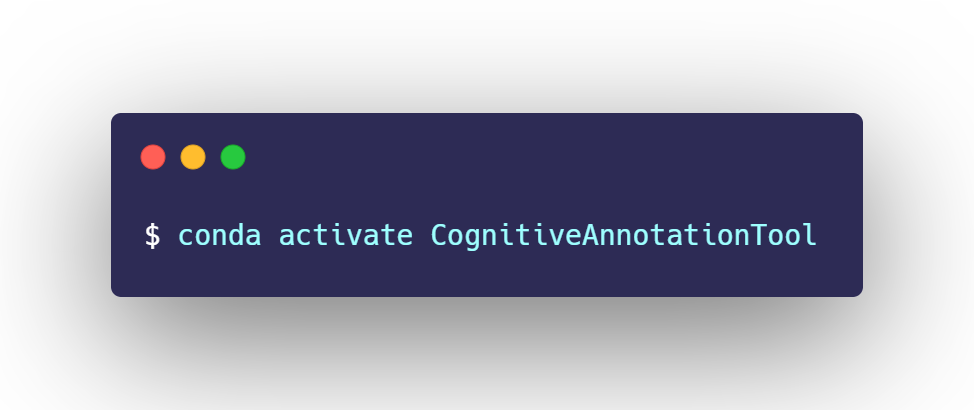
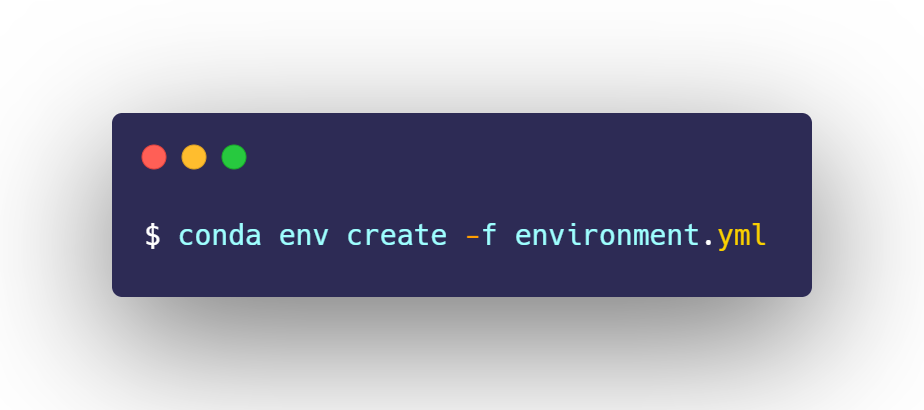
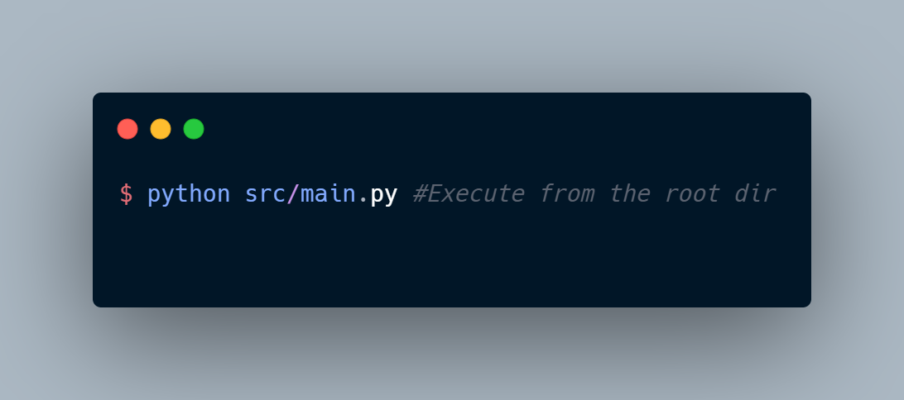

```
If you find this repo useful, kindly hit a star :), Feel free to extend the functionalities of the repo via PR requests.
```
## Demo Video
<a href="https://youtu.be/T67T9KhiwFU"> Link </a>

## Cognitive Annotation Tool
#### About the Software 
* An opensource annotation tool aimed to help researchers get rid of annotating images manually for computer vision tasks like object detection and object localisation using the webcam feed. 
* The Tool creates annotation of images in <a href="http://host.robots.ox.ac.uk/pascal/VOC/"> Pascal VOC </a> format as .xml files corresponding to each image. The tool also generates annotations as csv file.
* The generated annotations are compatible for training machine learning/deep learning models using <a href="https://github.com/davisking/dlib"> Dlib- C++ </a> machine learning library or <a href="https://arxiv.org/abs/1708.02002"> Retinanet </a> based object detection models easily for custom object detection. For training retina-net based model, The user can refer to this <a href="https://github.com/fizyr/keras-retinanet">Github Repo. </a> 
* The Images and its corresponding annotation XML files are saved in the folder named entered by user in the GUI prompt during the initialisation of the software. 
* If the user wants to train a multi-stage object detector like Fast RCNN/Faster RCNN/Retinanet model for custom object detection then this jupyter notebook can be used to convert the Pascal VOC Annotation xml file(s).
* The software is capable of annotating bulk of images needed to create high quality custom machine learning/deep learning based object detectors from scratch or via Transfer learning.
* This tool can act as a automated version of <a href="https://imglab.in/"> ImgLab </a>

## Windows Executable
<a href=""> Download Link </a> :: Coming soon.

## Build from Source

### Prerequisite
1. Anaconda/Miniconda installed on Windows/Linux platform (Last checked to work on Windows 10)
2. Integrated webcam(preferably) or an external webcam, check this via ```$ python webcam_test.py```

#### Environment Configuration
1. Create a new environment using the <a href="https://github.com/Suraj520/CognitiveAnnotationTool/blob/master/environment.yml"> environment.yml </a>


2. Activate the environment using the following command

### Launch the GUI Annotation Tool

Upon successful execution of the script, A GUI should appear as depicted below.


#### Instructions to follow to annotate custom images using GUI.
Once the GUI of the Software appears. Follow these steps to get started with the annotation.
> 1.Enter the username or a custom class name for which you want the images to be annotated then click on the button " Submit User Name". To ensure that username is accepted, open the file explorer and search for an empty directory with the name entered in the prompt earlier. 
>> Avoid Clicking the <strong> submit user name </strong> button too many times as it may lead to the creation of multiple folders.


>  2. Once the username is submitted, click on the <strong> Capture Bounding Box(s) </strong> button until two image windows containing snapshots of Image captured from the webcam appears. 
> > The two Image windows may be overlapping, slide the window to find the image window named as  'Window for Drawing bounding box'.


> 3. Using mouse click-release and click-hold events, Draw bounding box(s) around the objects you wish to annotate.
> >  If you want to create a object detector capable of detecting multiple objects draw multiple bounding box(s) around the object. (Keep track of the number of objects annotated from the terminal. If by mistake a wrong bounding box is drawn use 'd' key to delete.

> 4.Once bounding box(s) is/are drawn, press p to start automatic annotation of images over realtime webcam feed. Once annotation is finished click <strong>Exit </strong> button on the GUI.
>> RGB Images and their corresponding bounding box annotations are appended iteratively in the annotation.xml file which are saved in the directory created by user in Step 1.

> 5. Now, The user can use annotation.xml file saved in Directory created in Step1, to either generate Pascal VOC annotations (i.e an xml file containing annotation corresponding to each image) using the <a href=""> jupyter notebook file </a> or csv files(train,test,val) for training RetinaNet architecture using this <a href=""> jupyter notebook file </a>.

> 6. The user can use the prepared annotation files to train the object detection network using transfer learning or from scratch.

#### Remarks:
> Multiple object annotation depends upon the processing power of the system on which the code is executed as lag persists if bounding box of more than 10 objects are created over webcam feed using a 2.5 Ghz (Quadcore Intel pentium, 4 GB Ram) system.

#### Extra Notes.

###### 1. Editing the annotation.xml file

If the user wants to use the annotations generated on one system onto other(typically a cloud server like GCP/Azure/AWS), The following steps can be incorporated. 

* Edit the path of all the images labelled in the annotation.xml file by using a Text editor (Sublime Text/gedit/emacs/atom etc) through find all and replace all functionality.
  > The path is described within single quotes inside annotation.xml file which needs to be changed as per the path of Instance.
  >>For example: In <strong> sublime text </strong>, press Ctrl+F then follow the steps as described below.
  >>> For changing ```<image file='/home/abc/Desktop/Username/Username_x.jpg'>``` by 
   ```<image file='/ghf/xyz/newpath/Username/Username_x.jpg'>```, Paste ```/home/abc/Desktop/Username/``` to the <strong> find all section </strong> in the above mentioned editor and once all changes are located, replace it by ```/ghf/xyz/newpath/Username/``` by pasting it in replace all tab of the same editor.

###### A. CSV generator
<a href="https://github.com/Suraj520/CognitiveAnnotationTool/tree/master/notebooks/CSVAnnotationGenerator.ipynb "> XML to CSV Converter </a>
```
1. Mention correctly the path to xml file in jupyter notebook and the path where you want to generate csv annotations as annotation.txt
2. Remember to put class name in one of the cell wherever it is mentioned. The generated CSVs can directly be used to train RetinaNet models.
```

###### B. Pascal VOC XML generator
Coming soon: With TFOD Compatibility(Tensorflow Object detection toolbox).
```
After you execute main.py, you should be getting a core xml file which you can easily split into multiple xml files using few lines of code. Neverthless, I will try to upload the helper script soon :)
```

###### C. DLIB DNN-MOD/HOG+SVM COMPATIBLE
<a href="http://dlib.net/dnn_mmod_ex.cpp.html"> Dlib DNN_MMOD</a>
<a href="https://github.com/davisking/dlib/blob/master/python_examples/train_object_detector.py"> Dlib HOG+SVM </a>
```
Use the annotations as it is without any modification to train dlib's DNN_mmod or HOG+SVM object detector. Don't forget to add correlation tracking to your realtime pipeline for better results :).
```

###### 2. Steps to follow to get best results from the software

> Suppose you are willing to create an object detector for a Water Bottle, now as you are aware that inorder to create robust object detectors, The model must be trained on a variety of in the wild images.
>> Let's us assume different scenarios that we might prefer for creating a best fit/accurate object detector with high mAP score
 >>> * Scenario 1: Varying the light conditions.
>>> * Scenario 2: Varying the angle of image acquisition device(if,handheld).
>>> * Scenario 3: Non-uniform background etc.

> Then, the user must run the software for each of the above mentioned scenarios.
>> * For Scenario 1 : Put user name as Case 1, submit and record the annotated images of the Water bottle for some time. The annotations for each automatically labelled image will be stored in Case1.xml.
>>> Similarly repeat the execution for Case 2, Case 3,... Case n.. so that finally we get .xml files corresponding to each case. 

> Now, Put all images in a single folder, copy and paste all annotations recorded in a single annotation.xml file
>> Remember that while doing the task of appending all the annotation into a single .xml file, path conflicts may pop up which can be resolved by using the aforementioned strategy of ```find all and replace all``` in any text editor.

> Finally you will have a large dataset for training your machine learning/deep learning based object detector from scratch(incase transfer learning via ImageNet is not possible).

### Built With

* [davisking/dlib](https://github.com/davisking/dlib)- Machine learning library.

## License

This project is licensed under the LGPLv3.0 License - see the [LICENSE.md](LICENSE.md) file for details


### Citation
If you find the tool helpful, please cite my paper.
```My name is not in BibTex file(though I am the first author) due to Google Scholar not being able to parse mononymous names -_- ```
```
@inproceedings{kool2018visual,
  title={Visual machine intelligence for home automation},
  author={Kool, Ish and Kumar, Dharmendra and Barma, Shovan and others},
  booktitle={2018 3rd International Conference on Internet of Things: Smart Innovation and Usages (IoT-SIU)},
  pages={1--6},
  year={2018},
  organization={IEEE}
}
```
### Restrictions of usage
Strictly for Research purposes!
For commercial usages, obtain a license [](mailto:hrishabhsuraj52@gmail.com)
